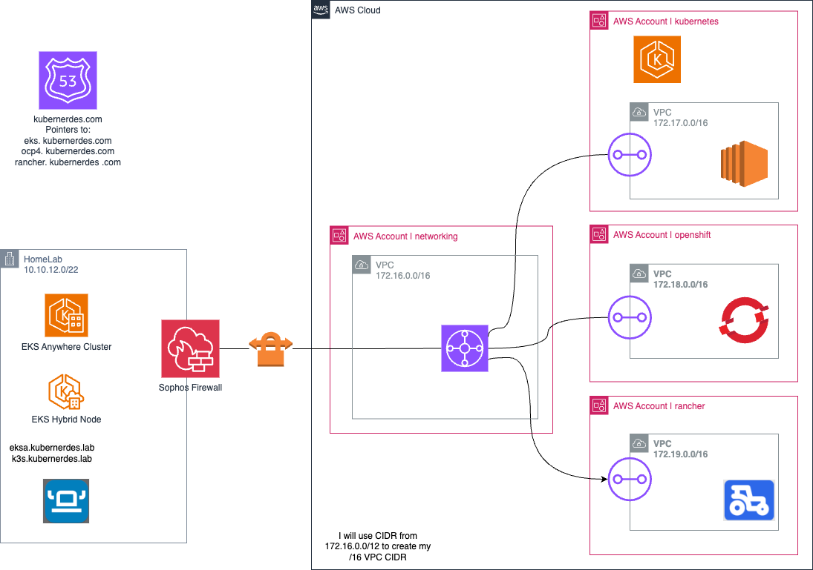

# kubernerdes.lab

Lab environment for hosting containers and VMs consisting of:

* Amazon EKS, Amazon EKS Anywhere, Amazon EKS Hybrid Nodes
* VMware vSphere 
* SUSE Rancher
* Red Hat OpenShift
* SpectroCloud 

## Status
Status:  Work In Progress

## Overview

I am redoing my "lab content" and separating the different environments in to repos aligned with the tech - a single repo would be difficult to manage and likely be overwhelming and confusing.

*.kubernerdes.lab => my on-premesis (HomeLab) environment (internal domains)  
*.kubernerdes.com => public (AWS) environments (external domains)

| Repo Name | URL | Purpose |
|:----------|:----|:--------|
| eks.kubernerdes.com | https://github.com/cloudxabide/eks.kubernerdes.com | Amazon EKS and EKS Hybrid Node |
| eksa.kubernerdes.lab | https://github.com/cloudxabide/eksa.kubernerdes.lab | Amazon EKS Anywhere |
| k3s.kubernerdes.lab | https://github.com/cloudxabide/k3s.kubernerdes.lab | SUSE K3s |
| kubernerdes.lab | https://github.com/cloudxabide/kubernerdes.lab | Main Repo Kubernerdes Project(s) |
| openshift.kubernerdes.com | https://github.com/cloudxabide/openshift.kubernerdes.com | Red Hat OpenShift |
| www.kubernerdes.com | https://github.com/cloudxabide/www.kubernerdes.com | Website content for https://www.kubernerdes.com/ |


Amazon EKS - 
Amazon EKS Hybrid Nodes -
Amazon EKS-Anywhere - This implementation pattern represents an "edge deployment" facilitating a hybrid cloud architecture.  This will enable you to run containers and virtual machines on gear that requires lower resources (space, power, cooling, etc...) in an enclave capable of being independent of external resources.
Red Hat OpenShift - 
SpectroCloud -

In this project I have intentionally tried to rely on things like BASH shell scripting so that you can see what is actually occurring (rather than simply seeing: SUCCESS! after some magic stuff happens from running some Terraform )




## Purpose 
This repository will provide an opinionated deployment to create an environemnt to run containers and virtual machines on commodity hardware using Open Source Software where possible.  In general, this approach will rely on the standard implementation guidance and focus on the integration of all the different technologies.

## Getting Started

Firstly, you should grab the example "ENV.vars" file and update it with your own values (or continue using the user/repo from this repo

replace <GIT_OWNER> with the Git Owner where the repo is being stored, then run the following:
```
git clone https://github.com/<GIT_OWNER>/kubernerdes.lab.git
cd kubernerdes.lab
vi Files/ENV.vars
. ./Files/ENV.vars
cd Scripts
```

I have created the scripts using the old Init Script notation of numerically numbered files.  You can decided which ones you would like to run, or not.


